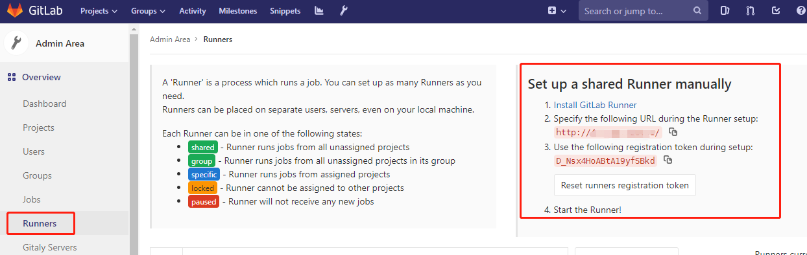
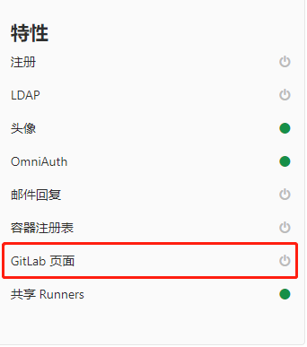

# Runner

### 安装 Runner

##### 添加 GitLab 官方仓库：

```shell
# For RHEL/CentOS/Fedora

curl -L https://packages.gitlab.com/install/repositories/runner/gitlab-runner/script.rpm.sh | sudo bash
```

##### 安装最新版本的GitLab Runner，或跳到下一步骤安装指定版本

```shell
 # For RHEL/CentOS/Fedora
 sudo yum install gitlab-runner
```

##### 安装特定版本的GitLab Runner

```shell
 # for RPM based systems
 yum list gitlab-runner --showduplicates | sort -r
 sudo yum install gitlab-runner-10.0.0-1
```

### 注册Runner

Runner 有五种类型：

* shared - 执行所有未分配项目的作业
* group -  执行所在组所有未分配项目的作业
* specific - 执行已分配项目的作业
* locked - Runner不能分配给其他项目
* paused - Runner不能接收任何新作业

#### 注册共享Runner

管理员账号才能注册共享Runner，且仅能注册一个。

##### 在 `admin/runners`页上获取共享Runner token



##### [注册操作](#注册流程)


##### 注册完成后，`admin/runners`页面看到runner记录


##### 添加子域名(泛域名解析)

在服务器上添加域名解析，如阿里云等
```
*.page.xxx.com 192.168.22.23
```

配置好后，用户可通过`username.page.xxx.com`访问pages

##### 修改gitlab配置文件
   
```
vi /etc/gitlab/gitlab.rb

pages_external_url "http://page.xxx.com"
gitlab_pages['enable'] = true
```

执行gitlab重配置、重启命令:

```
gitlab-ctl reconfigure

gitlab-ctl restart
```

配置成功，则admin页面上的 GitLab Pages项处于启用状态



##### 编写 .gitlab-ci.yml 文件

项目需要使用Pages功能时，在根目录下添加并填写 .gitlab-ci.yml 文件。


#### 注册流程

##### 执行下面命令：

```bash
[root@kz gitlab]# gitlab-runner register

```

##### 输入GitLab实例URL（`admin/runner`页中的链接）：

```bash
[root@kz gitlab]# gitlab-runner register
Runtime platform                                    arch=amd64 os=linux pid=14694 revision=ac2a293c version=11.11.2
Running in system-mode.                            
                                                   
Please enter the gitlab-ci coordinator URL (e.g. https://gitlab.com/):
http://47.110.228.131/

```

##### 输入token（`admin/runners`页上获取）:

```bash
Please enter the gitlab-ci token for this runner:
D3s24_Nsx4HoABtA19yfSBkd

```

##### 输入Runner描述，后续可在页面上修改
   
```bash
Please enter the gitlab-ci description for this runner:
[iZbp19xg5vv2b5wnt0avavZ]: shared-runner

```

##### 输入Runner标签，后续可在GitLab平台修改

```bash
Please enter the gitlab-ci tags for this runner (comma separated):
shared
Registering runner... succeeded                     runner=D_Nsx4Ho

```

##### 选择执行器

不确定选择哪个就选择 shell

```bash
Please enter the executor: docker, virtualbox, docker+machine, docker-ssh+machine, docker-ssh, parallels, shell, ssh, kubernetes:
shell
```

全部脚本：

```bash

[root@kz gitlab]# gitlab-runner register
Runtime platform                                    arch=amd64 os=linux pid=15281 revision=ac2a293c version=11.11.2
Running in system-mode.                            
                                                   
Please enter the gitlab-ci coordinator URL (e.g. https://gitlab.com/):
http://47.110.228.131/
Please enter the gitlab-ci token for this runner:
D3s24_Nsx4HoABtA19yfSBkd
Please enter the gitlab-ci description for this runner:
[iZbp19xg5vv2b5wnt0avavZ]: ob-shared-runner
Please enter the gitlab-ci tags for this runner (comma separated):
shared
Registering runner... succeeded                     runner=D_Nsx4Ho
Please enter the executor: docker, virtualbox, docker+machine, docker-ssh+machine, docker-ssh, parallels, shell, ssh, kubernetes:
shell
Runner registered successfully. Feel free to start it, but if it's running already the config should be automatically reloaded!

```


### 参考

[`Installing the Runner`](https://docs.gitlab.com/runner/install/linux-repository.html)

[`Registering Runners`](https://docs.gitlab.com/runner/register/index.html)

[`Registering a shared Runner`](https://docs.gitlab.com/ee/ci/runners/#registering-a-shared-runner)

[`GitLab Pages`](https://docs.gitlab.com/ee/administration/pages/index.html)